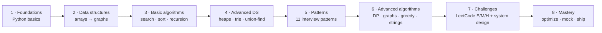

<!-- KEYWORDS: python data structures and algorithms, coding interview prep python, leetcode python solutions, FAANG interview prep, algorithm patterns python, DSA tutorial, python algorithms course, big-o cheat sheet, sliding window python, two pointers python, dynamic programming python, grokking the coding interview, cracking the coding interview python, elements of programming interviews, neetcode alternative, pytest dsa, mkdocs python course, gpl python curriculum -->

<div align="center">

# LuminaPy

**Master Python data structures and algorithms by running code you wrote — not memorizing code you read.**

[](https://github.com/Harery/LuminaPy/actions/workflows/ci.yml)
[](LICENSE)
[](https://www.python.org/downloads/release/python-3120/)
[](https://github.com/Harery/LuminaPy/actions/workflows/ci.yml)
[](https://github.com/Harery/LuminaPy/stargazers)

</div>

> An 8-phase Python DSA curriculum and coding-interview lab. Eleven interview patterns, Big-O-annotated code, a 48-test pytest suite, MkDocs site, one-click Codespaces. You run every algorithm; you don't just read it.

<p align="right"><sub><code>DRAWING NO. 02.00  ·  REV. 2026.05  ·  SHEET 02 OF 05</code></sub></p>

[The problem](#the-problem) | [Install](#install) | [Quickstart](#quickstart) | [What you get](#what-you-get) | [How it works](#how-it-works) | [Pattern index](#pattern-index) | [If you also use…](#if-you-also-use) | [FAQ](#faq) | [Documentation](#documentation) | [Roadmap](#roadmap) | [Contributing · License · Security](#contributing--license--security)

---

## The problem

Most Python DSA repos give you a dump of LeetCode solutions or animated explainers with no runnable code. Neither builds intuition. LuminaPy is a structured curriculum: every algorithm is an importable module with Big-O on top, a pytest covering it, and a phase that tells you when to learn it.

---

## Install

```bash
git clone https://github.com/Harery/LuminaPy.git && cd LuminaPy && uv sync --all-extras
```

---

## Quickstart

```bash
uv run pytest verify/tests -v                          # run the 48-test suite
uv run python ship/scripts/daily_challenge.py          # pull today's coding challenge
uv run mkdocs serve                                    # serve docs at http://127.0.0.1:8000
```

Prefer `pip`? `python3 -m venv .venv && source .venv/bin/activate && pip install -e ".[dev,notebooks]"`. Prefer zero install? [Open in GitHub Codespaces](https://codespaces.new/Harery/LuminaPy?quickstart=1).

---

## What you get

A workflow-shaped tree mirroring the 8 phases:

```
LuminaPy/
├── intake/        Onboarding, prerequisites, roadmap
├── learn/         Cheatsheets, Jupyter notebooks, animations
├── build/         Foundations · data-structures · algorithms · patterns · challenges
├── verify/        Pytest suite (48 tests, CI-gated)
├── ship/          Devcontainer, Docker, CLI scripts (daily_challenge, interview_simulator)
├── record/        MkDocs Material docs site
└── govern/        Security, citation, code of conduct
```

### Big-O cheat sheet

Quick reference; full version in [`learn/cheatsheets/big-o-cheatsheet.md`](learn/cheatsheets/big-o-cheatsheet.md).

| Operation | Array      | Hash table | BST (balanced) | Heap      | Linked list |
|:--        |:--         |:--         |:--             |:--        |:--          |
| Access    | O(1)       | —          | O(log n)       | —         | O(n)        |
| Search    | O(n)       | O(1) avg   | O(log n)       | O(n)      | O(n)        |
| Insert    | O(n)       | O(1) avg   | O(log n)       | O(log n)  | O(1)        |
| Delete    | O(n)       | O(1) avg   | O(log n)       | O(log n)  | O(1)        |

Sorting: Quick / Merge / Heap = `O(n log n)` · Counting / Radix = `O(n + k)` · Bubble / Insertion = `O(n²)`.
Graphs (V vertices, E edges): BFS/DFS = `O(V + E)` · Dijkstra (binary heap) = `O((V+E) log V)` · Floyd–Warshall = `O(V³)`.

---

## How it works

Eight phases take you from `for` loops to FAANG mock interviews. Each phase has its own folder, a `README.md` with goals, runnable modules, and tests.



| # | Phase                | Folder                                                                  | Focus                                                          | Est.    |
|:--|:--                   |:--                                                                      |:--                                                             |:--      |
| 1 | Foundations          | [`build/foundations/`](build/foundations/)                              | Variables, control flow, functions, generators, decorators    | 2 wk    |
| 2 | Data structures      | [`build/data-structures/`](build/data-structures/)                      | Arrays, strings, hash tables, lists, stacks, queues, trees, graphs | 4 wk |
| 3 | Basic algorithms     | [`build/algorithms/`](build/algorithms/)                                | Searching, sorting, recursion                                  | 3 wk    |
| 4 | Advanced DS          | [`build/data-structures/08-advanced/`](build/data-structures/)          | Heaps, tries, segment trees, disjoint sets                     | 3 wk    |
| 5 | Patterns             | [`build/patterns/`](build/patterns/)                                    | 11 interview patterns covering ~80% of LeetCode                | 4 wk    |
| 6 | Advanced algorithms  | [`build/algorithms/`](build/algorithms/)                                | DP, graph algorithms, greedy, string algorithms                | 4 wk    |
| 7 | Challenges           | `build/challenges/`                                                     | LeetCode easy / medium / hard + system design                  | ongoing |
| 8 | Mastery              | [`ship/scripts/`](ship/scripts/)                                        | `interview_simulator.py`, `benchmark_sorting.py`, mock loops   | ongoing |

### Pick your path

| If you are…                                | Start here                                                                                                    | Time budget |
|:--                                         |:--                                                                                                            |:--          |
| Absolute beginner (new to Python)          | [`build/foundations/`](build/foundations/) → [`build/data-structures/`](build/data-structures/)               | 4–6 weeks   |
| Intermediate dev brushing up DSA           | [`build/data-structures/`](build/data-structures/) → [`build/algorithms/`](build/algorithms/)                 | 3–4 weeks   |
| Interview cram (2 weeks out)               | [`build/patterns/`](build/patterns/) → [`learn/cheatsheets/`](learn/cheatsheets/)                             | 2 weeks     |
| Educator building a syllabus               | [`record/docs/`](record/docs/) + notebooks in [`learn/notebooks/`](learn/notebooks/)                          | self-paced  |

---

## Pattern index

Eleven battle-tested patterns. Each folder has a `README.md` (when to use it, complexity, classic problems) and a runnable `pattern.py`.

| Pattern                       | Folder                                                                                | When to reach for it                                |
|:--                            |:--                                                                                    |:--                                                  |
| Two Pointers                  | [`build/patterns/two-pointers`](build/patterns/two-pointers)                          | Sorted arrays, pair sums, in-place dedup            |
| Sliding Window                | [`build/patterns/sliding-window`](build/patterns/sliding-window)                      | Contiguous subarray/substring with a constraint     |
| Fast & Slow Pointers          | [`build/patterns/fast-slow-pointers`](build/patterns/fast-slow-pointers)              | Cycle detection, middle of linked list              |
| Merge Intervals               | [`build/patterns/merge-intervals`](build/patterns/merge-intervals)                    | Overlapping intervals, meeting rooms                |
| Cyclic Sort                   | [`build/patterns/cyclic-sort`](build/patterns/cyclic-sort)                            | Arrays containing `1..N`                            |
| In-place Linked-List Reversal | [`build/patterns/fast-slow-pointers`](build/patterns/fast-slow-pointers)              | Reverse sublist, K-group reversal                   |
| Tree BFS                      | [`build/patterns/tree-bfs-dfs`](build/patterns/tree-bfs-dfs)                          | Level order, right-side view, zig-zag               |
| Tree DFS                      | [`build/patterns/tree-bfs-dfs`](build/patterns/tree-bfs-dfs)                          | Path sums, tree serialization                       |
| Two Heaps                     | [`build/patterns/two-heaps`](build/patterns/two-heaps)                                | Running median, scheduling                          |
| Subsets                       | [`build/patterns/subsets`](build/patterns/subsets)                                    | Combinations, permutations, power set               |
| Modified Binary Search        | [`build/patterns/modified-binary-search`](build/patterns/modified-binary-search)      | Rotated arrays, search in answer space              |

Bonus: [`top-k-elements`](build/patterns/top-k-elements) and [`island-matrix`](build/patterns/island-matrix) ship alongside the canonical eleven.

---

## If you also use…

Positive cross-references — these pair well with LuminaPy: *Cracking the Coding Interview* (CtCI) for theory and behavioral prep, *Grokking the Coding Interview* for the pattern taxonomy this repo follows, *Elements of Programming Interviews* (EPI) for harder problems, and [NeetCode](https://neetcode.io/) for video walkthroughs.

---

## FAQ

### How do I start?

Clone, run `uv sync --all-extras`, then open [`build/foundations/`](build/foundations/) if you're new to Python or [`build/data-structures/`](build/data-structures/) if you already know Python. Every module is runnable: `python build/data-structures/01-arrays-lists/array.py` executes it.

### What's the time commitment?

Plan on 8–12 weeks part-time (10 hrs/week) to traverse all 8 phases. Cramming with 2 weeks until your loop? Skip to [`build/patterns/`](build/patterns/) plus [`learn/cheatsheets/`](learn/cheatsheets/) — those cover ~80% of LeetCode mediums.

### Which patterns matter most for FAANG?

From real FAANG interview loops: Sliding Window, Two Pointers, Tree BFS/DFS, Two Heaps (top-K), Modified Binary Search, DP, and Graph traversal. All eleven are in [`build/patterns/`](build/patterns/) with classic problems mapped to each.

### How is this different from NeetCode, LeetCode, CtCI?

It complements them. Read CtCI for theory, watch NeetCode for visuals, grind LeetCode for raw volume — then use LuminaPy as the runnable companion with Big-O annotations and pytest coverage on every algorithm.

### Can I use this in a classroom?

Yes. There's a syllabus draft in [`record/docs/`](record/docs/) and Jupyter notebooks in [`learn/notebooks/`](learn/notebooks/). Cite via [`CITATION.cff`](CITATION.cff) if you adopt it.

### Why GPL and not MIT?[^1]

Educational material benefits from staying open. GPL-3.0-or-later means any fork or derivative remains free for the next learner — the same way this repo was free for you.

[^1]: The rest of the OCTALUME family ships under MIT; LuminaPy is the one deliberate exception because its primary output is curriculum, not infrastructure.

---

## Documentation

- Live docs site (MkDocs Material): <https://harery.github.io/LuminaPy/>
- Cheatsheets: [`learn/cheatsheets/`](learn/cheatsheets/)
- Notebooks: [`learn/notebooks/`](learn/notebooks/)
- Marketing & social preview: [MARKETING.md](MARKETING.md) · [SOCIAL_PREVIEW.md](SOCIAL_PREVIEW.md)
- Progress journal: [PROGRESS.md](PROGRESS.md)

---

## Roadmap

- **2026-Q3** — Video walkthroughs for each of the 11 patterns
- **2026-Q4** — System-design module (capstone for phase 7)
- **2027-Q1** — Go and Rust ports of the pattern catalog
- **2027-Q2** — Interactive web playground (run patterns in-browser via Pyodide)
- **Ongoing** — New LeetCode solutions, notebook visualizations, classroom-ready slide decks

---

## Contributing · License · Security

- Contributing: [CONTRIBUTING.md](CONTRIBUTING.md) · [CODE_OF_CONDUCT.md](CODE_OF_CONDUCT.md) — good first issues are tagged [`good first issue`](https://github.com/Harery/LuminaPy/labels/good%20first%20issue).
- License: **GPL-3.0-or-later** — see [LICENSE](LICENSE). Cite via [CITATION.cff](CITATION.cff).
- Security: [SECURITY.md](SECURITY.md) — report vulnerabilities privately.

<!-- ============================================================== -->
<!-- UNIFIED OCTALUM FAMILY FOOTER — keep verbatim across every repo -->
<!-- ============================================================== -->

---

<div align="center">

### Drawn by the same hand

A working portfolio of digital infrastructure, designed and maintained by [**Mohamed Harery**](https://harery.com) — Architect of Digital Systems.

| Sheet | Repo | What it is |
|:--:|:--|:--|
| 00 | [**harery.com**](https://github.com/Harery/Mo) | The studio — portfolio, ledger, contact |
| 01 | [**OCTALUME**](https://github.com/Harery/OCTALUME) | 8-phase enterprise SDLC framework |
| 02 | [**LuminaPy**](https://github.com/Harery/LuminaPy) | Python DSA & coding-interview prep |
| 03 | [**OCTALUM-PULSE**](https://github.com/Harery/OCTALUM-PULSE) | Cross-distro Linux maintenance CLI |
| 04 | [**octalum-bdtb**](https://github.com/Harery/octalum-bdtb) | 12-stage Claude Code Skill — brain-dump → product |

<sub>
  <a href="https://harery.com">harery.com</a> ·
  <a href="https://github.com/Harery">github.com/Harery</a> ·
  <a href="https://www.linkedin.com/in/harery/">LinkedIn</a>
</sub>

<sub>BLUEPRINT · drawn 2026 · MIT-licensed code · all drawings reserved</sub>

</div>
