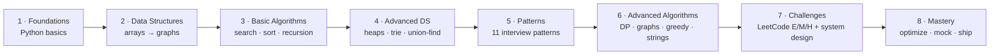

<p align="center">
  <a href="https://github.com/Harery/OCTALUM-PYLAB">
    
  </a>
</p>

<h1 align="center">OCTALUM&nbsp;PYLAB</h1>

<p align="center">
  <strong>Master Python Data Structures &amp; Algorithms through guided experimentation.</strong><br/>
  An 8-phase lab — from Python basics to FAANG-level interview patterns — with runnable code, tests, visualizations, and a Big-O cheat sheet baked in.
</p>

<p align="center">
  <a href="https://www.python.org/downloads/release/python-3120/"></a>
  <a href="https://github.com/Harery/OCTALUM-PYLAB/actions/workflows/ci.yml"></a>
  <a href="https://docs.astral.sh/ruff/"></a>
  <a href="https://docs.pytest.org/"></a>
  <a href="https://harery.github.io/OCTALUM-PYLAB/"></a>
  <a href="https://github.com/Harery/OCTALUM-PYLAB/blob/master/LICENSE">
  </a>
  <a href="https://github.com/Harery/OCTALUM-PYLAB/stargazers"></a>
</p>

<p align="center">
  <a href="#-pick-your-path">Pick Your Path</a> •
  <a href="#-quick-start">Quick Start</a> •
  <a href="#-the-8-phases">8 Phases</a> •
  <a href="#-pattern-index">Pattern Index</a> •
  <a href="#-big-o-cheat-sheet">Big-O</a> •
  <a href="#-docs">Docs</a> •
  <a href="#-contributing">Contributing</a>
</p>

---

## Why OCTALUM-PYLAB?

Most DSA repos give you either (a) thousands of unstructured LeetCode dumps, or (b) pretty animations with no code you can run. This one is different:

- **Learn by experimenting** — every algorithm is a small, importable Python module you can run, edit, and test.
- **Pattern-first** — 11 interview patterns (Sliding Window, Two Pointers, Top-K, Two Heaps, …) each with their own folder and explanation.
- **Big-O everywhere** — time and space complexity annotated at the top of every implementation.
- **Tested** — `pytest` suite covers foundations, data structures, and algorithms. CI runs on every push.
- **A complete curriculum**, not a snippet dump — 8 phases that take you from `for` loops to FAANG-style mock interviews.

---

## 🧭 Pick Your Path

Skip to the track that matches where you are today:

| If you are… | Start here | Time budget |
|---|---|---|
| 🌱 **A beginner** (new to Python) | [`build/foundations/`](build/foundations/) → [`build/data-structures/01-arrays-lists/`](build/data-structures/) | 4–6 weeks |
| 🛠 **A mid-level dev** brushing up DSA | [`build/data-structures/`](build/data-structures/) → [`build/algorithms/`](build/algorithms/) | 3–4 weeks |
| 🎯 **Interview cramming** (2–4 weeks out) | [`build/patterns/`](build/patterns/) → [`learn/cheatsheets/`](learn/cheatsheets/) | 2–4 weeks |
| 🧑‍🏫 **An educator** building a syllabus | [`record/docs/`](record/docs/) + Jupyter notebooks in [`learn/notebooks/`](learn/notebooks/) | self-paced |
| 🏆 **Already grinding LeetCode** | [`build/patterns/`](build/patterns/) + [`learn/cheatsheets/patterns-cheatsheet.md`](learn/cheatsheets/patterns-cheatsheet.md) | ongoing |

---

## 🚀 Quick Start

### Option 1 — GitHub Codespaces (zero install)

[](https://codespaces.new/Harery/OCTALUM-PYLAB?quickstart=1)

### Option 2 — Local with [uv](https://docs.astral.sh/uv/) (recommended)

```bash
git clone https://github.com/Harery/OCTALUM-PYLAB.git
cd OCTALUM-PYLAB

# Install uv if you don't have it
curl -LsSf https://astral.sh/uv/install.sh | sh

# Install everything (Python 3.12, deps, dev tools)
uv sync --all-extras

# Run the full test suite
uv run pytest verify/tests -v

# Get today's coding challenge
uv run python ship/scripts/daily_challenge.py
```

### Option 3 — Plain `pip`

```bash
git clone https://github.com/Harery/OCTALUM-PYLAB.git
cd OCTALUM-PYLAB
python3 -m venv .venv && source .venv/bin/activate
pip install -e ".[dev,notebooks]"
pytest verify/tests -v
```

---

## 🗺️ The 8 Phases



| # | Phase | Folder | Focus | Est. |
|---|---|---|---|---|
| 1 | **Foundations** | [`build/foundations/`](build/foundations/) | Variables, control flow, functions, generators, decorators | 2 wk |
| 2 | **Data Structures** | [`build/data-structures/`](build/data-structures/) | Arrays, strings, hash tables, linked lists, stacks, queues, trees, graphs | 4 wk |
| 3 | **Basic Algorithms** | [`build/algorithms/01–03`](build/algorithms/) | Searching, sorting, recursion | 3 wk |
| 4 | **Advanced DS** | [`build/data-structures/08-advanced/`](build/data-structures/) | Heaps, tries, segment trees, disjoint sets | 3 wk |
| 5 | **Patterns** | [`build/patterns/`](build/patterns/) | 11 interview patterns that cover ~80% of LeetCode | 4 wk |
| 6 | **Advanced Algorithms** | [`build/algorithms/04–07`](build/algorithms/) | DP, graph algorithms, greedy, string algorithms | 4 wk |
| 7 | **Challenges** | `build/challenges/` | LeetCode easy / medium / hard + system design | ongoing |
| 8 | **Mastery** | [`ship/scripts/`](ship/scripts/) | `interview_simulator.py`, `benchmark_sorting.py`, mock interviews | ongoing |

---

## 🧩 Pattern Index

Eleven battle-tested patterns. Each folder has a `README.md` (when to use it, complexity, classic problems) and a runnable `pattern.py`.

| Pattern | Folder | When to reach for it |
|---|---|---|
| Sliding Window | [`patterns/sliding-window`](build/patterns/sliding-window) | Contiguous subarray/substring with a constraint |
| Two Pointers | [`patterns/two-pointers`](build/patterns/two-pointers) | Sorted arrays, pair sums, in-place dedup |
| Fast & Slow Pointers | [`patterns/fast-slow-pointers`](build/patterns/fast-slow-pointers) | Cycle detection, middle of linked list |
| Merge Intervals | [`patterns/merge-intervals`](build/patterns/merge-intervals) | Overlapping intervals, meeting rooms |
| Cyclic Sort | [`patterns/cyclic-sort`](build/patterns/cyclic-sort) | Arrays containing 1..N |
| Tree BFS / DFS | [`patterns/tree-bfs-dfs`](build/patterns/tree-bfs-dfs) | Level order, path sums, tree serialization |
| Two Heaps | [`patterns/two-heaps`](build/patterns/two-heaps) | Running median, scheduling |
| Subsets | [`patterns/subsets`](build/patterns/subsets) | Combinations, permutations, power set |
| Modified Binary Search | [`patterns/modified-binary-search`](build/patterns/modified-binary-search) | Rotated arrays, search in answer space |
| Top-K Elements | [`patterns/top-k-elements`](build/patterns/top-k-elements) | K-th largest, K closest, frequency counts |
| Island / Matrix DFS | [`patterns/island-matrix`](build/patterns/island-matrix) | Grid traversal, connected components |

---

## ⏱️ Big-O Cheat Sheet

Quick reference — full version in [`learn/cheatsheets/big-o-cheatsheet.md`](learn/cheatsheets/big-o-cheatsheet.md).

| Operation | Array | Hash Table | BST (balanced) | Heap | Linked List |
|---|---|---|---|---|---|
| Access | O(1) | — | O(log n) | — | O(n) |
| Search | O(n) | O(1) avg | O(log n) | O(n) | O(n) |
| Insert | O(n) | O(1) avg | O(log n) | O(log n) | O(1) |
| Delete | O(n) | O(1) avg | O(log n) | O(log n) | O(1) |

**Sorting:** Quick/Merge/Heap = `O(n log n)` · Counting/Radix = `O(n + k)` · Bubble/Insertion = `O(n²)`

**Graphs (V vertices, E edges):** BFS/DFS = `O(V + E)` · Dijkstra (binary heap) = `O((V+E) log V)` · Floyd–Warshall = `O(V³)`

---

## 📁 Repo Layout

The 8 top-level folders mirror an engineering workflow (`intake → learn → build → verify → ship → record → govern`), so you can find anything in seconds:

```
OCTALUM-PYLAB/
├── intake/        Onboarding · prerequisites · roadmap
├── learn/         Cheat sheets · Jupyter notebooks · animations
├── build/         The core: foundations, data-structures, algorithms, patterns, challenges
├── verify/        Pytest suite + coverage
├── ship/          Devcontainer, Docker, CLI scripts (daily_challenge, interview_simulator, …)
├── record/        MkDocs site source (record/docs)
└── govern/        Security & compliance
```

---

## 📚 Docs

The full docs site is built with **MkDocs Material** and deployed to **GitHub Pages**:

➡️ **<https://harery.github.io/OCTALUM-PYLAB/>**

Build it locally:

```bash
uv run mkdocs serve   # → http://127.0.0.1:8000
```

---

## ✅ Testing

```bash
uv run pytest verify/tests -v          # all tests
uv run pytest verify/tests --no-cov -q # quick run
uv run ruff check .                     # lint
uv run ruff format --check .            # format
uv run pyright build/                   # type check
```

CI runs the full gate on every push & PR (see [`.github/workflows/ci.yml`](.github/workflows/ci.yml)).

---

## 🤝 Contributing

PRs welcome — see [CONTRIBUTING.md](CONTRIBUTING.md). Good first issues are tagged [`good first issue`](https://github.com/Harery/OCTALUM-PYLAB/labels/good%20first%20issue). The repo follows [Conventional Commits](https://www.conventionalcommits.org/) and the [Contributor Covenant](CODE_OF_CONDUCT.md).

Easy ways to help:

- Add a new pattern or LeetCode solution (template in `.github/ISSUE_TEMPLATE/new_problem.yml`)
- Write a Jupyter notebook visualization for `learn/notebooks/`
- Improve a cheatsheet in `learn/cheatsheets/`
- File an issue when complexity annotations are wrong or missing

---

## 📜 License

**GNU General Public License v3.0 or later** — see [LICENSE](LICENSE).  
You may use, modify, and redistribute under the terms of GPLv3.

If you use OCTALUM-PYLAB in research or teaching, please cite it via [`CITATION.cff`](CITATION.cff).

---

## 🙏 Acknowledgments

Inspiration drawn from [TheAlgorithms/Python](https://github.com/TheAlgorithms/Python), [keon/algorithms](https://github.com/keon/algorithms), [donnemartin/system-design-primer](https://github.com/donnemartin/system-design-primer), and the Grokking the Coding Interview series.

---

<p align="center">
  Built by <a href="https://harery.com">Mohamed Harery</a> · part of the <strong>OCTALUME</strong> project family.<br/>
  <em>If this repo helped you land a job, an interview, or a deeper understanding — please ⭐ it.</em>
</p>
